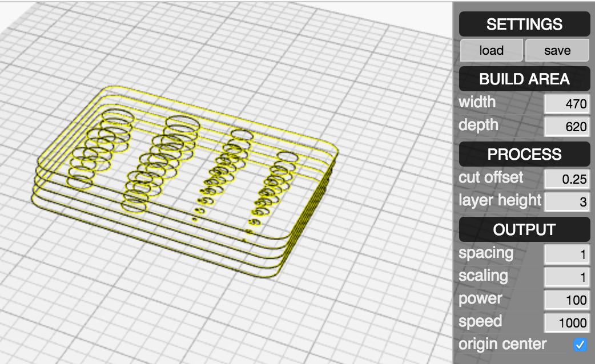
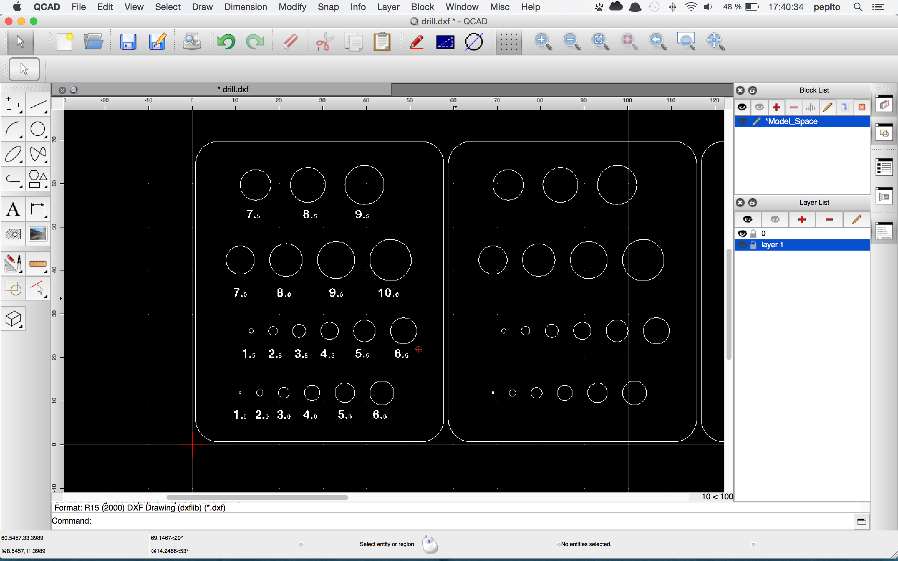
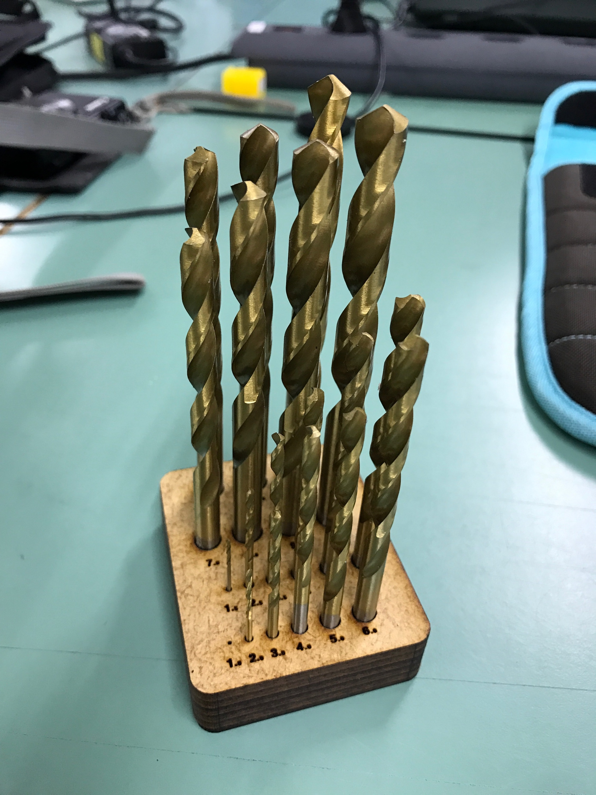

# 3D objects with a laser cutter

In this example I will do an holder for drill bits.
I Bought in china some cheap drill bits, but it came without any case.
My goal will be to do a basic holder for drill bits to be easy accessible and well organized on my workbench.

## What do you need ?

1. laser cutter
2. material
3. [onshape](https://www.onshape.com/) account
4. [Kiri:Moto](https://grid.space/kiri) plugin
5. [qcad](http://www.qcad.org/)
6. time

## First designing our 3D object

I suggest you to follow an [onshape tutorial](https://www.onshape.com/videos/topic/tutorials) if you don't know how to do it. It's quite simple and easy to use.

### 2D Sketch

### Extrude top part
As my material is 3mm, I used a multiplier of 3, here 5*3, you can use arithmetic formula directly in onshape.

### Extrude bottom part

### Boolean union of the 2 extruded parts

## Slicing with Kiri:Moto

### Opening plugin Kiri:Moto
If you don't have it, you can find it in the App Store of onshape, it's free.

### Import your part

### Setup Kiri moto for slicing
Select "Laser Cutting" mode, then on the right side of the screen you have few parameter to adjust to your material. My material is a MDF 3mm so I change layer height to 3

### Slice your object
Just click on Export on the left side, to save your file in somewhere in your computer, choose as dxf to be able to modify it.

## QCAD

### Edit with QCAD
With QCAD will add some mark to identify each bits.
The layer 0 is my layer for cutting, layer 1 is the one for marking.

Layer 0 (cutting) must have a width of 0mm, otherwise the laser cutter will just ignore it.

### Final export for laser cutter
You can notice I re-organized my different material layer to fit to my raw material.

## Time to make real thing

### Laser cutter
Choose the right setting to cut your material and cut it.

### Assembly
To be a real 3D object you have to glue each parts together, and let it dry.

## What you can do more with this method ?
I did this. All the plastic case was before I organized every thing with it. I don't tell you the nightmare to look for the the right bit and the right collet.

