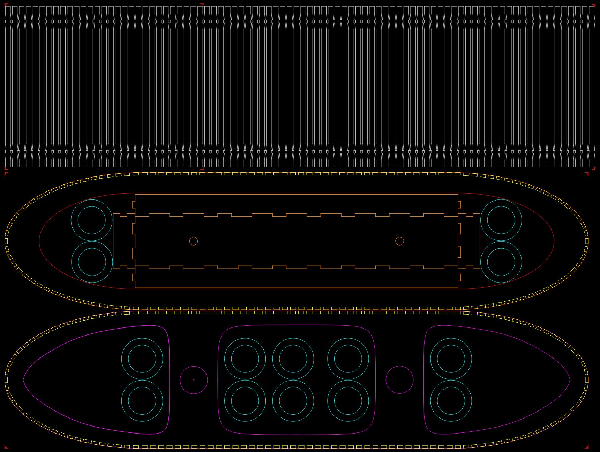

# Lamp

## What do you need to do it ?

This lamp is made using :

*  1 time plywood 410x860mm 4mm for structure
*  2 times plywood 210x860mm 5mm or 6mm for the bars
*  2 ikea [SEKOND](http://www.ikea.com/ch/fr/catalog/products/50279373/) for bulb support

## How do it ?

It will be laser cut in Zurich fablab

The export folder contains all necessary file for laser cutter used in this fablab, I hope it will be compatible with the one you will use.

Use some wood glue to stick all bars to the structure